**Vehicle Detection Project**

The goals/steps of this project are the following:

* Perform a Histogram of Oriented Gradients (HOG) feature extraction on a labeled training set of images and train a classifier Linear SVM classifier. - Done
* Optionally, you can also apply a color transform and append binned color features, as well as histograms of color, to your HOG feature vector. - Done
* Note: for those first two steps don't forget to normalize your features and randomize a selection for training and testing. - Done
* Implement a sliding-window technique and use your trained classifier to search for vehicles in images. - Done
* Run your pipeline on a video stream (start with the test_video.mp4 and later implement on full project_video.mp4) and create a heat map of recurring detections frame by frame to reject outliers and follow detected vehicles. - Done
* Estimate a bounding box for vehicles detected. - Done


## [Rubric](https://review.udacity.com/#!/rubrics/513/view) Points
###Here I will consider the rubric points individually and describe how I addressed each point in my implementation.  

---
###Writeup / README

####1. Provide a Writeup / README that includes all the rubric points and how you addressed each one.  You can submit your write-up as markdown or pdf.  [Here](https://github.com/udacity/CarND-Vehicle-Detection/blob/master/writeup_template.md) is a template write-up for this project you can use as a guide and a starting point.  

You're reading it!

The code I used for doing this project can be found in `Main.py` and `Main.ipynb`. 


###Histogram of Oriented Gradients (HOG)

####1. Explain how (and identify where in your code) you extracted HOG features from the training images.

First, the glob package is used to read in all the files in the dataset. I created two help functions `load_imgs` and `plot_imgs`. They are located in cell 2 in notebook and lines 35-54.


I started by loading all the `vehicle` and `non-vehicle` images.  Here is an example of one of each of the `vehicle` and `non-vehicle` classes:
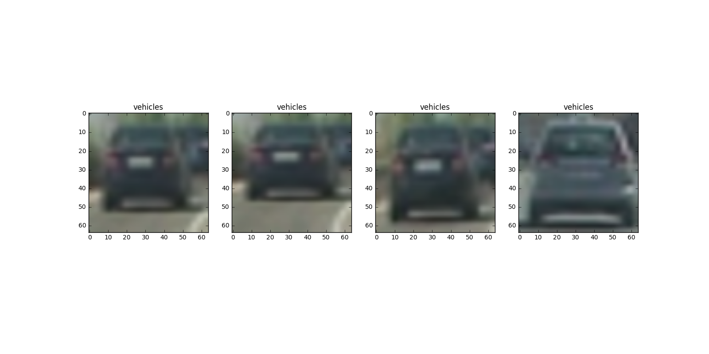
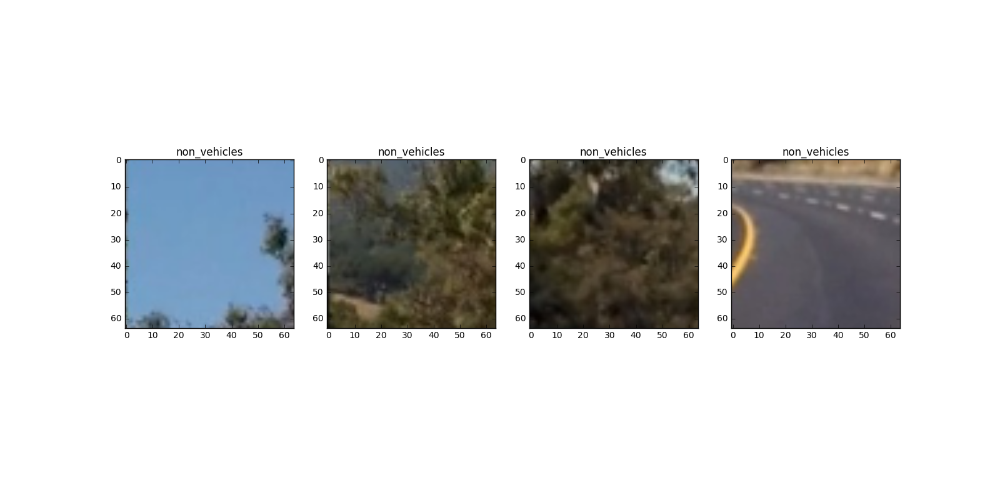


I then explored different color spaces and different `skimage.hog()` parameters (`orientations`, `pixels_per_cell`, and `cells_per_block`).  I grabbed random images from each of the two classes and displayed them to get a feel for what the `skimage.hog()` output looks like.

Here is an example using the `RGB` and `HSV` color spaces and HOG parameters of `orientations=8`, `pixels_per_cell=(8, 8)` and `cells_per_block=(2, 2)`:
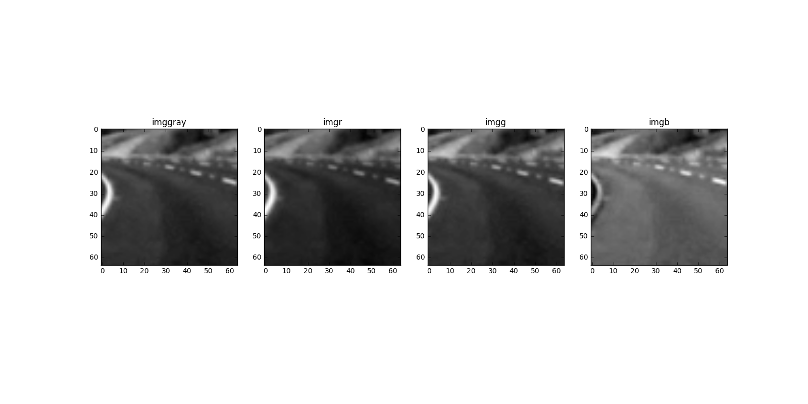 fig3_color_transform_1_non_vehicle_2.png
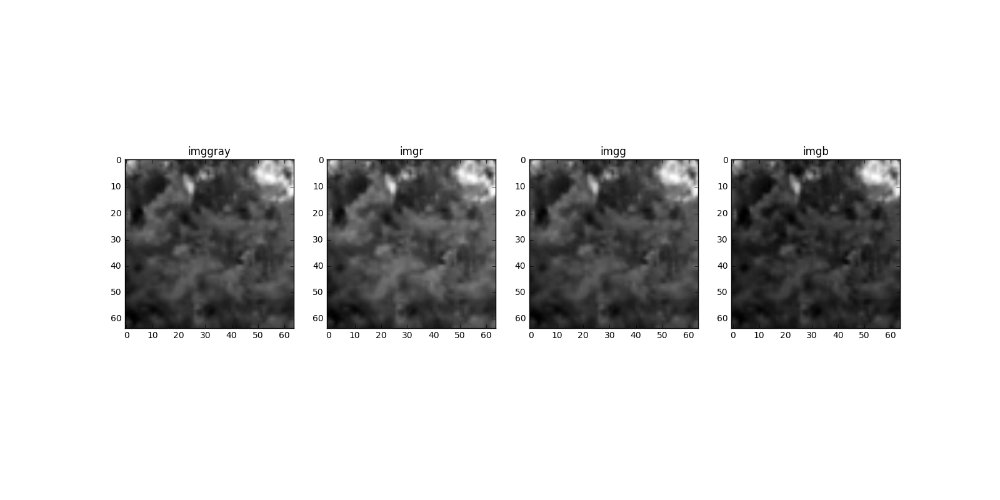 fig3_color_transform_1_non_vehicle.png
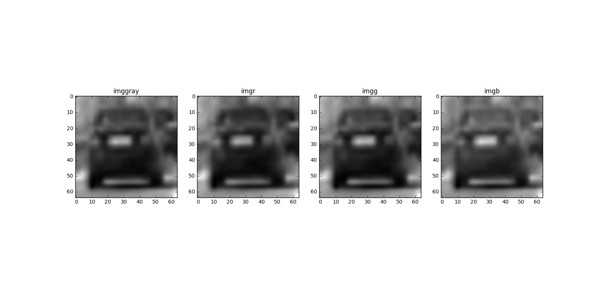 fig3_color_transform_1_vehicle.png
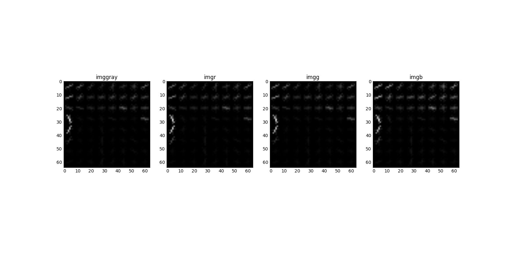 fig3_hog_features_1_non_vehicle_2.png
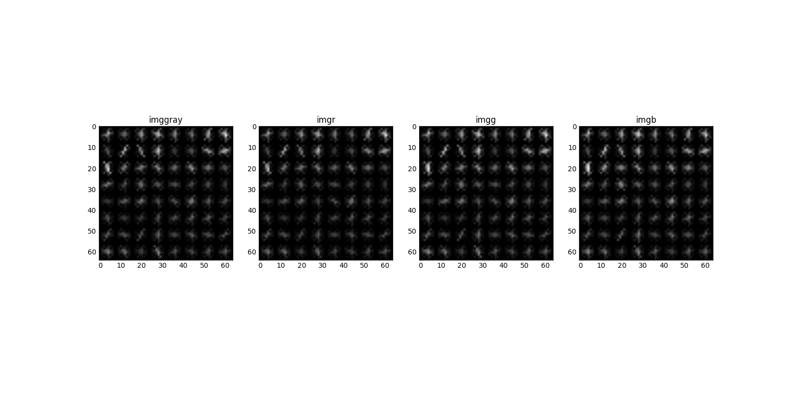 fig3_hog_features_1_non_vehicle.png
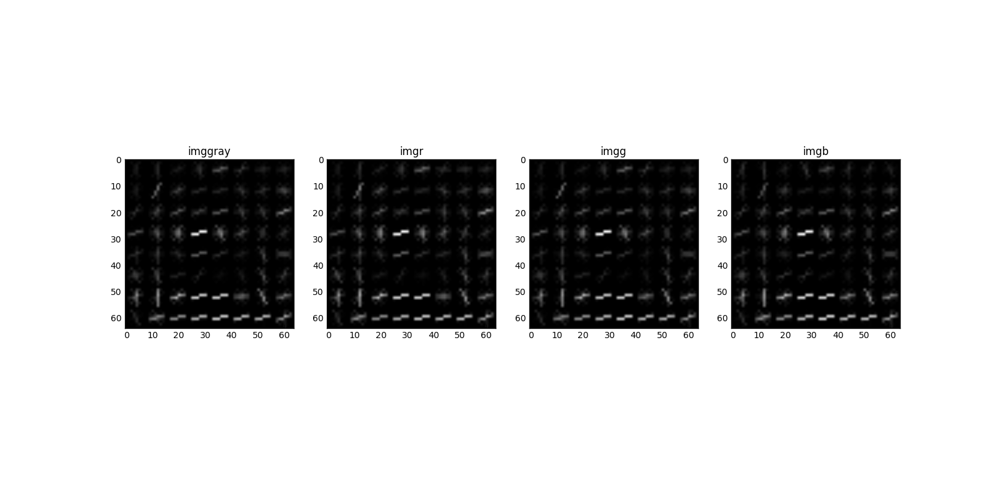 fig3_hog_features_1_vehicle.png
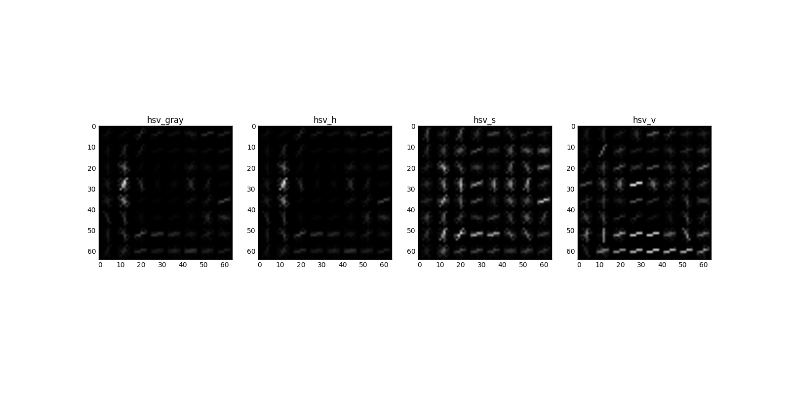 fig3_hog_features_2_vehicle.png

The code is located in cells 6 and 7, lines 82-127
####2. Explain how you settled on your final choice of HOG parameters.

I manually tried various combinations of parameters and selected does that gave me best visual discrimination.
This can be meta-parameter and the full pipeline could be optimized using parameter search.

####3. Describe how (and identify where in your code) you trained a classifier using your selected HOG features (and color features if you used them).

The training dataset provided for this project ( [vehicle](https://s3.amazonaws.com/udacity-sdc/Vehicle_Tracking/vehicles.zip) and [non-vehicle](https://s3.amazonaws.com/udacity-sdc/Vehicle_Tracking/non-vehicles.zip) images) are in the .png format. 

A LinearSVC was used as the classifier for this project. 
* First I create a `extract_features(img)` function which transforms the image into 8 color schemes and then extracts the HOG features for each color transform. Code is located between lines 136-140, and `transform_image(img)` in Main.ipynb cell 6 and (Main.py 95-107).
* Then, in lines 145-149 I create the x and y features and labels for training. Then I serilize to the disk to save time when re-run.
* Following cell (line number 159 is used to split the data into train and test sets.). I use 10% CV set.
```
X_train, X_test, y_train, y_test = train_test_split(x, y, test_size=0.10, random_state=166)
```
* Then I create the classifier Pipeline. (171-177)
```
clf = Pipeline([('feature_selection', SelectKBest(chi2, k=5000)),
                ('scaling', StandardScaler()),
                ('classification', LinearSVC(loss='hinge')),
               ])
```
* Finally I train the classifier and measure the test accuracy. After manual parameter tunning of the `feature_selection` transformation and the HOG features I achieved test accuracy of 98%. Model is seriallized to the disk.


###Sliding Window Search

####1. Describe how (and identify where in your code) you implemented a sliding window search.  How did you decide what scales to search and how much to overlap windows?

The code for the `slide_window` function is at 207-249. I use parameters to control start and stop x and y positions. window size, and window overlap.
Here is an example outpout of the `slide_window` function:
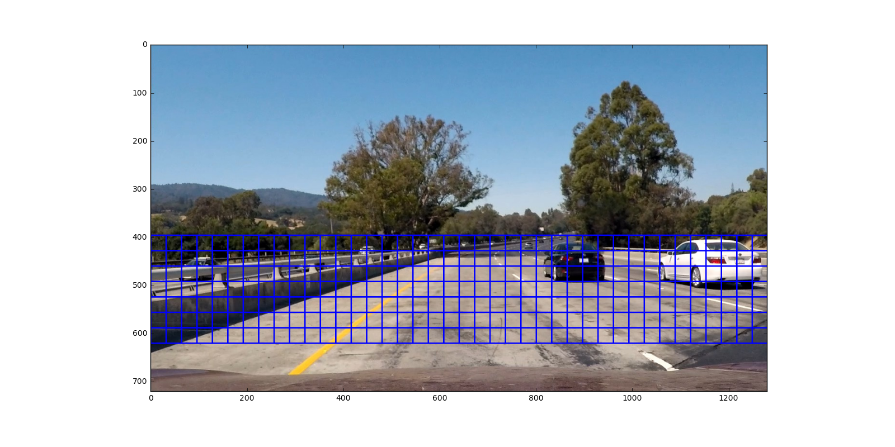 fig4_sample_windows.png

####2. Show some examples of test images to demonstrate how your pipeline is working.  What did you do to optimize the performance of your classifier?

After that I use the following functions in the pipeline:
* `draw_boxes(img, bboxes, color=(0, 0, 255), thick=6)` (200-205) - to draw the found boxes of cars over the images.
* `def find_cars(img...)` (272-290) - For each window in the image - extract HOG features and predict if there is a car in the window.
* `find_cars_multiSize` (293-305) - Reuse the `find_cars` function, but use different sizes of windows.
I also use several other help functions:
`draw_detections`, `find_and_mark`, `add_heat`, `apply_threshold`, `bbox_from_labels`, `bboxes_from_detections`.

Here are some images from the pipeline:
 fig5_marked_windows_1.png
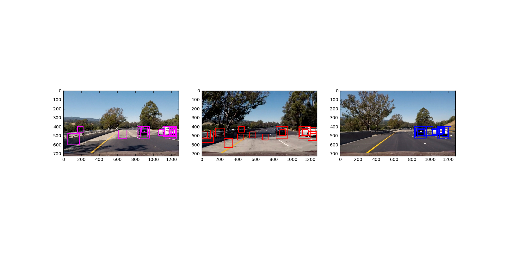 fig5_marked_windows_2.png
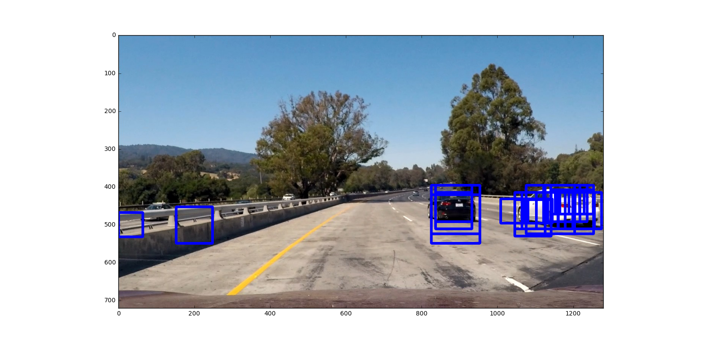 fig5_marked_windows_single_image.png
 fig6_after_threshold_heatmap_marked_2.png
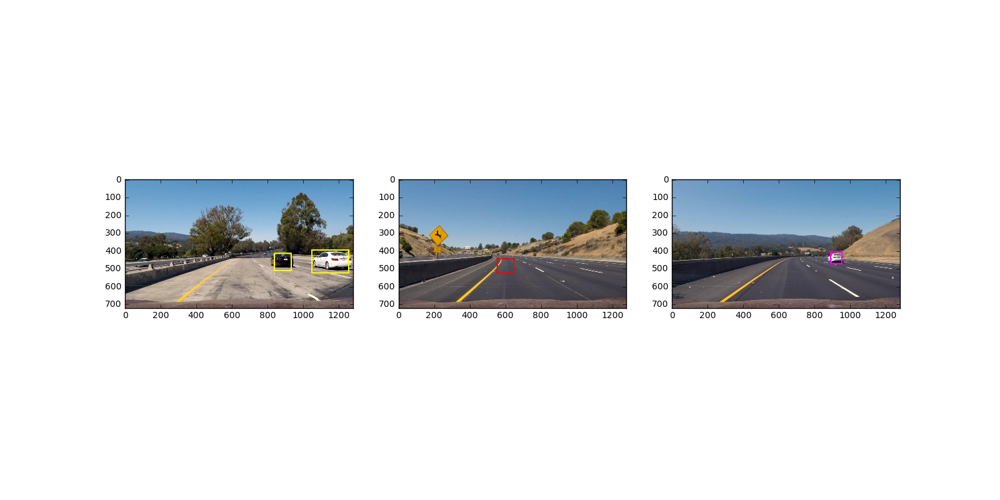 fig6_after_threshold_heatmap_marked.png
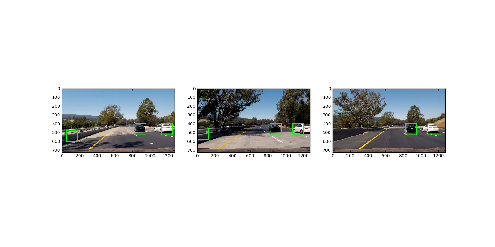 fig7_after_threshold_heatmap_marked_2.png
 fig7_after_threshold_heatmap_marked.png

The pictures are selected so there are visible examples of each class: True Positive, True Negative as well as False Positive and False Negative.

---

### Video Implementation

####1. Provide a link to your final video output.  Your pipeline should perform reasonably well on the entire project video (somewhat wobbly or unstable bounding boxes are ok as long as you are identifying the vehicles most of the time with minimal false positives.)
Here's a [link to my test video result](./test_video_out.mp4)

Here's a [link to my video result](./project_video_out2.mp4)


####2. Describe how (and identify where in your code) you implemented some kind of filter for false positives and some method for combining overlapping bounding boxes.

The main video processing function is called `combined_box` (404-409) and accepts a single frame as a parameter.

I recorded the positions of positive detections in each frame of the video.  From the positive detections, I created a heatmap and then thresholded that map to identify vehicle positions.  I then used `scipy.ndimage.measurements.label()` to identify individual blobs in the heatmap.  I then assumed each blob corresponded to a vehicle.  I constructed bounding boxes to cover the area of each blob detected.  

During experimentation, I saw this is not enough as the blobs are too shaky and there were still many false positives. So I decided to create another filter, where I kept exponentially decaying heat map of the previous filters. This helped a lot to reduce the false positives. Experimenting showed best results when multiplying by 3/4. (377-379)
```
global heatmap_cont
heatmap = np.zeros((img.shape[0],img.shape[1]))
heatmap = add_heat(heatmap, detections)

heatmap_cont = heatmap_cont if not heatmap_cont is None else (heatmap*2)
heatmap += heatmap_cont
heatmap_cont = heatmap * 3/4

heatmap = apply_threshold(heatmap, threshold)
labels = label(heatmap)
```

---

###Discussion

####1. Briefly, discuss any problems/issues you faced in your implementation of this project.  Where will your pipeline likely fail?  What could you do to make it more robust?

I think this was very exciting, challenging, and interesting project. Some of the places for improvements in the model are:
* Very slow processing. The pipeline should be optimized for speed, as the the 50s. video takes more than 3 hours to process.
* Hyper and meta parameter optimization - the classifier, the threshold for boxes, the windows sizes, and all the other meta and hyperparameters in the pipeline.
* A different classifier for the different sizes of patches instead of resizing the patch could improve the classification process.
* More features. I used only HOG features from 8 different color transforms. Many other options could be investigated.
* Kalman filter and working with previous frames and predicting future position would be another interesting advancement of the project.
* Better visualization of the found objects may improve the feeling of the algorithm.
* Finally, but not least I would like to investigate some deep learning algorithm pipelines.
